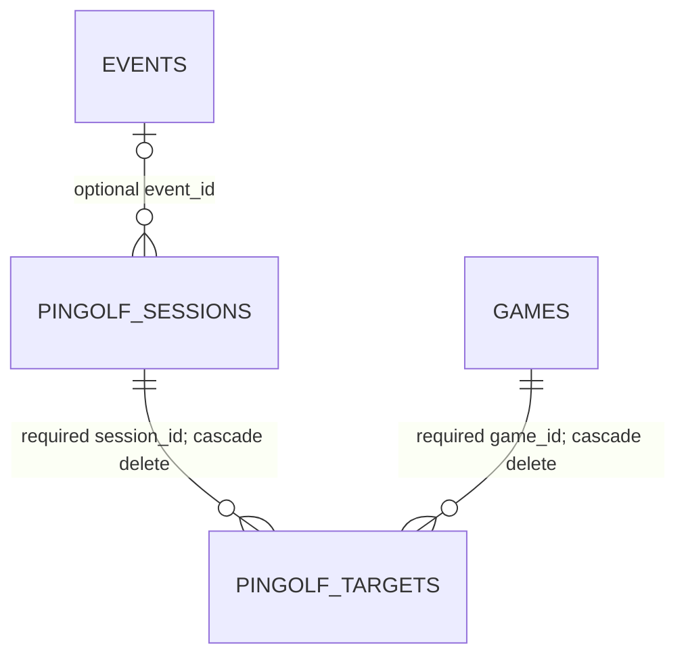
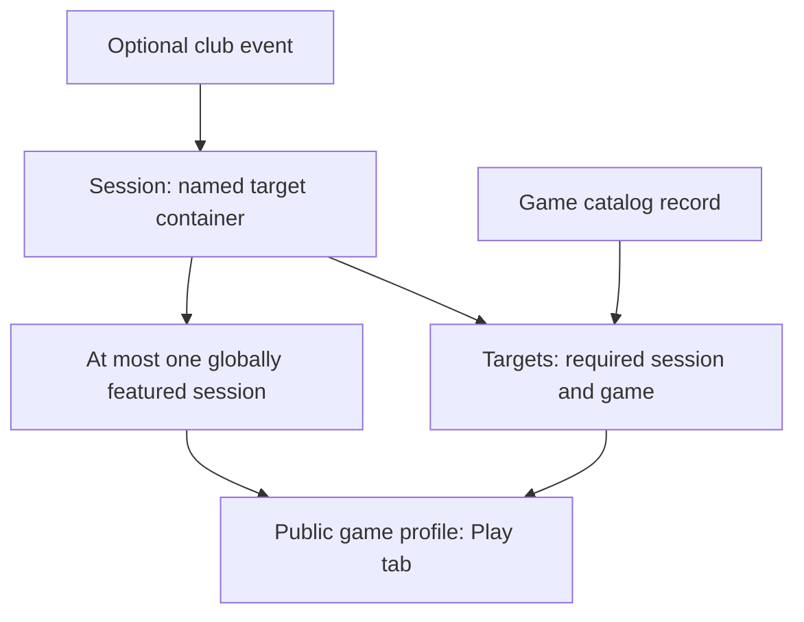

# Current Pingolf data model and implementation

> Historical snapshot: Pingolf session descriptions document the pre-refactor system.
> See [Pingolf targets](pingolf-targets.md) for the replacement model and permissions.

Date: 2026-09-29. Repository: SNHPC `pinball-club-website`. Reviewed checkout HEAD: `0670064a5a43f87c27ce0fafe9bcca5e3d5475f8`.

## Scope and evidence

This report traces repository migrations and browser code. It describes the schema and behavior defined by this checkout, not a verified inventory of the deployed database or its current rows. No production database was queried, migrations applied, or application behavior changed. Existing untracked authorization documents were read as context, not treated as implementation authority.

Source references below use repository-relative paths and line ranges for review. The principal sources are:

| Reference | Source and relevant implementation |
|---|---|
| S1 | `supabase/migrations/20260507143000_extended_game_data.sql`: tables 115–143; timestamp triggers 176–184; RLS 201–202; editable-game helper 217–233; Pingolf RPCs 396–643; original public More Info RPC 904 onward. |
| S2 | `supabase/migrations/20260508140000_owner_parties.sql`: replacement `snh_public_game_more_info`, especially featured-session selection and targets 481–504; public execute grant at end. This is the latest definition found of this RPC. |
| S3 | `supabase/migrations/20260501103000_games_catalog.sql`: shared audit table 8–27; games table 35 onward; access helpers 149–186; private audit writer 191–219. |
| S4 | `supabase/migrations/20260523140000_rls_explicit_deny_client_roles.sql`: explicit false policies on sessions, targets, and audit log. |
| S5 | `assets/js/member-games-panel.js`: form 365–397; visibility 1077–1086; featured lookup 2246–2259; target/session workflows 2412–2541; form population 2624–2628; panel initialization and contextual edit at end. |
| S6 | `assets/js/member-portal.js`: Pingolf RPC wrappers 962–1007, exported on `SNHMemberPortal` near end; public More Info wrapper near 1062. |
| S7 | `assets/js/games.js`: Pingolf renderer 613–627; profile tabs and live RPC request 740–860; More info and contextual Edit controls 1012 onward. |
| S8 | `members.html`: Games navigation role gate near 108; panel role mapping near 881. `assets/js/site-auth.js`: shared Games capability/role mapping. |
| S9 | `supabase/migrations/20260505135500_games_soft_delete.sql`: game soft-delete and restore; `20260523133000_linter_search_path_pg_net.sql`: updated shared timestamp helper. |
| S10 | `scripts/snapshots.mjs`, `scripts/export-games-json-from-supabase.mjs`, and `supabase/migrations/20260916100000_game_images.sql`: current public catalog view and snapshot/export path. |
| S11 | `supabase/migrations/20260921131000_audit_history_record_labels.sql`, `20260921124000_audit_retention.sql`, and `assets/js/member-audit-panel.js`: shared audit reading, labeling, retention, and UI. |
| S12 | `supabase/migrations/20260426170000_event_management_foundation.sql`, `20260427191015_restrict_event_delete_to_admin_roles.sql`, and `assets/js/member-portal.js` event delete wrapper near 601: event relationship and physical deletion path. |

Searches covered migrations, Edge Functions, browser assets, scripts/tests, HTML, data, and documentation. Build-output copies and historical event titles were distinguished from executable Pingolf functionality.

## 1. Data model

There are two dedicated Pingolf tables, five dedicated RPCs, and a Pingolf branch in the shared public game-detail RPC. There is no dedicated Pingolf view, scoring table, participant table, round table, course table, storage bucket, or Edge Function in the reviewed sources.

### `public.pingolf_sessions`

A named container for targets, with optional event/date metadata and a global public-display switch. [S1]

| Column | Type / constraints | Meaning |
|---|---|---|
| `id` | UUID primary key; default `gen_random_uuid()` | Session identity. |
| `title` | Text, NOT NULL | Name; creation RPC trims and rejects empty titles through the NOT NULL constraint. No unique-title constraint. |
| `event_id` | Nullable UUID FK to `public.events(id)` | Optional event link; default FK deletion behavior is NO ACTION, not cascade or SET NULL. |
| `starts_on` | Nullable date | Optional start date. |
| `ends_on` | Nullable date | Optional end date. |
| `is_featured` | Boolean, NOT NULL, default false | Selects the session used for public targets and the target-management UI. |
| `notes` | Nullable text | Session notes. |
| `created_at` | Timestamptz, NOT NULL, default `now()` | Creation time. |
| `updated_at` | Timestamptz, NOT NULL, default `now()` | Refreshed before every row update by a trigger. |

`pingolf_sessions_one_featured_idx` is a partial unique index on constant `(true)` where `is_featured`. It enforces **at most one** featured session across the entire table. Zero featured sessions and arbitrarily many nonfeatured sessions are allowed.

There is no date-order constraint, automatic date activation, status/completed flag, soft-delete marker, creator/owner FK, club/location scope, or membership link. Dates do not govern display. A session has zero or more targets; multiple sessions may reference the same event. No uniqueness enforces one session per event. [S1, S2]

### `public.pingolf_targets`

Each row describes one goal for one catalog game within one required session. [S1]

| Column | Type / constraints | Meaning |
|---|---|---|
| `id` | UUID primary key; default `gen_random_uuid()` | Target-row identity. |
| `session_id` | UUID, NOT NULL; FK to sessions, ON DELETE CASCADE | Required parent session. |
| `game_id` | UUID, NOT NULL; FK to games, ON DELETE CASCADE | Required catalog game. |
| `description` | Text, NOT NULL | Human-readable objective; RPC additionally requires trimmed nonempty text. |
| `target_value` | Nullable integer | Optional numeric goal. |
| `sort_order` | Integer, NOT NULL, default 0 | Display ordering key. |
| `created_at` | Timestamptz, NOT NULL, default `now()` | Creation time. |
| `updated_at` | Timestamptz, NOT NULL, default `now()` | Trigger-maintained modification time. |

Separate indexes exist on `session_id` and `game_id`. There is no unique `(session_id, game_id)` constraint, no uniqueness for description or order, and no positivity constraint on target value or order. Multiple targets for the same game in the same session are valid, including identical duplicates. There is no target type, unit, difficulty, par, ball/stroke limit, target-specific notes, creator, source/import key, or status.

### Related persistent structures

| Structure | Pingolf relationship |
|---|---|
| `public.games` | Target FK addresses a UUID catalog record, not an OPDB machine ID, Pinball Map ID, owner, or location stint. Game title/slug and `deleted_at` matter to lookup/display; floor presence is not an upsert requirement. Target data is separate from game metadata. |
| `public.events` | Optional parent reference from sessions. Event title, publication, and start time are not joined into Pingolf loading or selection. Event changes do not synchronize session title/dates. Physical event deletion is blocked while a session references it. |
| `public.members`, `public.member_roles`, `auth.users` | Authorization chain: role rows reference a member, whose `user_id` is compared with `auth.uid()`. There is no Pingolf participant or owner relationship. |
| `public.audit_log` | Shared provenance for RPC writes, stored under `module='games'`, entity types `pingolf_session` / `pingolf_target`. Not a FK parent of Pingolf records. |
| `public.games_catalog_v1` | Shared public game view includes stable game IDs for subsequent detail lookup, but does not embed targets or sessions. It is an indirect integration dependency, not a Pingolf projection. |

Audit columns are `id` UUID PK with random default; `created_at` timestamptz NOT NULL default now; required text `module`, `action`, `entity_type`, `entity_id`; optional `actor_user_id` UUID FK to `auth.users(id)` and `request_id` text; and required JSONB `old_data`, `new_data`, `metadata`, each default `{}`. `entity_id` is free text, not a referential constraint. Shared indexes support date/module/entity browsing. RPCs supply the actor through `auth.uid()`; session/target rows themselves retain no creator. Audit retention is implemented separately, so this is not permanent ownership metadata. [S3, S11]

### Relationship diagram

Sessions are independent of games until targets are added. Audit records and authorization memberships are supporting relationships rather than additional Pingolf entities.

## 2. What a session represents today

**Implementation fact:** a session is a named group of game targets. One session may be featured globally. Its optional event and dates are stored and returned to editor callers, but not used to schedule, complete, or score play. [S1, S2, S5]

**Reasonable interpretation:** it functions as a target-set configuration selected for public display. Calling it a tournament, course, round, or actual play session would add semantics the implementation does not enforce. The nullable event FK permits an event association but does not make a session an event.

Only targets have a required session FK. Sessions can exist empty; targets cannot exist without both a session and a game. There is no independent reusable-target repository.

### Lifecycle

| Action | Actual behavior |
|---|---|
| Create | Admin RPC inserts title, optional event/dates/notes, and featured flag. UI sends only title, notes, and featured flag; targets are not copied or created. |
| Feature | Sending `isFeatured:true` first updates all currently featured sessions to false, then inserts/updates the requested session in the same RPC transaction. Targets stay with their existing parents. |
| Update | RPC permits title/event/dates/featured/notes changes. Omitted fields are retained; explicit empty event/date/notes fields can clear nullable fields. Empty update title retains the old title. UI has no existing-session editor. |
| Unfeature | RPC can set an existing session false. No fallback session is selected automatically. No UI button exposes this. |
| Complete | No completion action, status transition, scoring result, or end-date automation exists. |
| Delete | No session-delete RPC or browser workflow exists. Privileged physical deletion would cascade to all its targets, and would not select a replacement featured session. |

The session update RPC does not check affected-row count: an unknown `p_id` can be returned and audited as an update. If that request also includes `isFeatured:true`, the prior session can be unfeatured even though no requested session exists. By contrast, an insertion error rolls back the transaction, including preliminary unfeaturing. [S1]

The singleton assumption is specifically **one featured session**, not one session or one date-active session. Browser code picks the first `isFeatured` row; SQL uses `WHERE is_featured LIMIT 1`, backed by the unique index. Both ignore dates, event visibility, and club floor presence. With none featured, public targets are `[]`, editor targets clear, and add silently returns without writing. [S2, S5]

## 3. Targets and game association

Description is the required objective. The optional signed PostgreSQL integer `target_value` adds a numeric goal; the code assigns no unit or meaning such as score versus shots. Public display is `description (goal: value)` when a value exists. This is not an achieved score, high-score entry, or stroke record. Fractional and out-of-range values cannot be stored by the integer cast. [S1, S7]

Multiple target rows may point to one game within one session or across sessions. Each belongs to exactly one session; sharing the same target row between sessions is impossible. Separate rows could carry identical descriptions/values, but no clone/copy/reuse operation exists in the repository.

Both editor and public RPCs sort targets by `sort_order`, then `description`; ties have no further stable key. The editor list RPC returns all targets in the requested session. Public output filters to one game first. UI creation omits `sortOrder`, so targets receive zero and sort alphabetically by description. There is no course-position/hole-number UI or schema constraint making ordering a unique position. [S1, S2, S5]

Target updates require the supplied target ID, session ID, and game ID to match the existing row. Only description, value, and order change. The RPC therefore does not support moving a target to another session or game. Updates replace those three fields: omitted value becomes NULL and omitted order becomes zero; description is still mandatory. Direct privileged SQL could change FKs to other existing parents, but that is not an application workflow.

| Parent change | Target effect |
|---|---|
| Session title, notes, dates, or event changes | Target row unchanged. |
| Featured session switches | Old targets remain stored but disappear from normal public/editor views; the new session's targets become visible. |
| Session physically deleted | Targets cascade-delete. |
| Game physically deleted | Targets cascade-delete. |
| Game soft-deleted by application | Targets remain stored. Public More Info returns NULL for that game; target upsert fails editable-game validation. Target delete still works via RPC. |
| Game restored | Retained targets can appear again if their session is featured. |
| Game title, external metadata, floor presence, or stint changes | FK identity and target row unchanged. No automatic target recalculation or removal. |

These follow the FKs, editable-game helper, soft-delete/restore functions, and public RPC's `deleted_at IS NULL` lookup. [S1, S2, S9]

## 4. RPC and application behavior

### Function inventory

All five dedicated RPCs are `SECURITY DEFINER`, set `search_path=public`, revoke PUBLIC execute, and grant execute to `authenticated`; role helpers still govern actual access. [S1]

| RPC | Return / behavior |
|---|---|
| `snh_pingolf_sessions_list_editor()` | JSONB array of all sessions: `id,title,eventId,startsOn,endsOn,isFeatured,notes`; sorted featured first, start date descending NULLS LAST, creation descending. Timestamps not projected. |
| `snh_pingolf_session_upsert(p_id uuid,p_fields jsonb)` | Returns session UUID. NULL ID creates; existing ID updates. Admin gate. |
| `snh_pingolf_targets_list_editor(p_session_id uuid)` | JSONB array: `id,sessionId,gameId,description,targetValue,sortOrder`; timestamps omitted. Any session can be requested, including nonfeatured; absent/NULL parent matches return `[]`. |
| `snh_pingolf_target_upsert(p_id uuid,p_session_id uuid,p_game_id uuid,p_fields jsonb)` | Returns void. Validates nondeleted game, existing session, nonempty description, integer value/order; NULL ID inserts, existing ID updates matching parents. No featured-session restriction. |
| `snh_pingolf_target_delete(p_id uuid)` | Returns void. Deletes by target ID regardless of featured state or game deletion; missing target is a no-op. Editor gate. |

Other involved functions: `snh_public_game_more_info(uuid)` returns public detail JSON including featured targets; `snh_member_has_games_access()` and `snh_member_has_games_admin_access()` implement role gates; `private.snh_require_game_editable(uuid)` verifies nondeleted game existence; `private.snh_audit_game(...)` persists RPC audit entries; `set_games_catalog_updated_at()` drives both update triggers. Shared `snh_audit_history_for_admin(...)` exposes their audit entries to Club Admin. [S1–S4, S9, S11]

### Member Tools / Games

`members.html` loads the Games panel for `games_editor`, `games_admin`, or `club_admin`. Public catalog Edit links can route to `members.html?panel=games&game=<UUID>`; there is no separate Pingolf page. [S5, S8]

Opening an existing game refreshes the featured-session ID, loads all its session's targets, filters them in the browser to `currentGameId`, and renders description/value plus Delete buttons. The target section is visible in game-edit mode and is a sibling of the session-admin section. It is hidden when creating a new game or idle. Add invokes target upsert with a NULL target ID, current game ID, featured session ID, description, and optional number. Delete confirms, calls the RPC, and reloads. These operations write immediately; they are not staged for the main game Save button. No target edit, reorder, transfer, or nonfeatured-session browsing control exists. [S5, S6]

For Games Admin / Club Admin, the existing-game form also shows “Pingolf sessions (games admin).” It lists every session's title, featured marker, and truncated ID. These are plain list items, not selection controls. The form asks for **new** title, featured checkbox, and notes. Although its button says “Save Pingolf session,” the handler always passes NULL ID, so it always creates. It exposes no event/date fields. [S5]

There is no user-selected current session persisted in browser storage, URL, or member preferences. `featuredPingolfSessionId` is a transient variable inferred from the global server flag. It refreshes on game population, subsequent panel-show handling, and successful session creation. No realtime subscription or automatic cross-browser refresh is present. Switching an existing session to featured is possible through the RPC/wrapper, but has no UI control. Creating a new featured session via the UI switches the current set to an initially empty one.

### Public game catalog

More info opens a game profile and calls `snh_public_game_more_info` live when Supabase and a valid game UUID are available. Its Pingolf branch chooses the globally featured session and returns only that game's `id,description,targetValue,sortOrder` target objects, not session title/ID, dates, notes, or event details. The Play tab renders these targets; high scores can also populate that tab, so no targets does not necessarily mean no Play tab. [S2, S7]

No at-club restriction appears in this RPC: any nondeleted game can return featured targets. No session or event selector is public. When live detail fetch fails or cannot run, normal game snapshot information remains available, but it contains no Pingolf fallback data.

### Imports, exports, integrations, and reporting

No Pingolf importer, CSV/template upload, batch target editor, session clone, scorecard export, results/standings report, or provider integration was found. Pinball Map and OPDB operate on games, not session/target records. Historic events whose titles contain Pingolf are ordinary event records, not linked automatically to sessions. [S1, S5, S10, S12]

Current game JSON exports query `games_catalog_v1`; they omit sessions and targets. The shared audit interface can display Pingolf writes as Games activity, but has no dedicated Pingolf record-label resolver. Session audit rows can fall back to a supplied title; target audit rows generally lack a human-readable title. [S10, S11]

Audit payloads have limitations: session insert/update stores supplied fields as new data and `{}` as old data; implicit unfeaturing of the previous session is not individually audited. Target insertion uses **game ID** as `entity_id`, recording session/description but not generated target ID, numeric value, or order. Target update uses target ID and full old row, but only description in new data; deletion records the full old row. Cascaded deletions have no dedicated Pingolf audit trigger. [S1, S3]

## 5. Authorization today

“Editor-level” below means the operation uses the general Games access helper; it does not propose a future policy. “Admin-level” means the narrower Games Admin helper. Both include Club Admin explicitly, through overlapping role checks rather than role-row inheritance. Membership roles, events roles, helpers, and ordinary membership alone confer no Pingolf-management access. [S3, S8]

| Operation | UI permits / exposes | Database gate | Current level / discrepancy |
|---|---|---|---|
| Public game targets | Any visitor via More info | Public RPC grants execute to anon/authenticated; no Games role required | Public read, featured only. |
| List sessions | Editors indirectly load featured selection; admins see session list | `games_editor`, `games_admin`, `club_admin` | Editor-level read; broader data accessible than UI displays. |
| Create session | `games_admin`, `club_admin`, in existing-game edit form | Same two roles | Admin-level, aligned. |
| Update / feature existing session | No UI workflow; wrapper supports ID | `games_admin`, `club_admin` | Admin-level, API-only functionality. |
| Delete / complete session | No UI | No dedicated RPC | No application capability to classify; privileged SQL deletion is separate. |
| List targets | All three Games roles, featured only in UI | All three; any requested session | Editor-level; backend not restricted to featured. |
| Create target | All three, requires current game and featured session in UI | All three; any existing session + nondeleted game | Editor-level; backend broader session access. |
| Update target / ordering | No UI edit/reorder workflow | All three with matching ID/session/game | Editor-level, RPC-only. |
| Delete target | All three see Delete buttons | All three; target ID alone | **Editor-level deletion**, not admin-only. No featured/nondeleted-game restriction on server. |
| Direct session/target table CRUD | Browser uses RPCs, no direct table workflow | RLS enabled; explicit false policies for anon/authenticated | Denied via normal client table access. SECURITY DEFINER/service-role/privileged access is a separate boundary. |
| Read Pingolf audit history | Club Admin shared audit UI | Shared audit-history RPC checks `club_admin` | Club Admin only, not Games Admin alone. |

**Correction relative to the earlier report:** `docs/current-roles-and-authorization-report.md` describes target controls as effectively admin-only in several places. The traced code does not support that statement: `setMode()` hides `pingolfTargetsWrapEl` only outside edit mode, while separately role-gating `pingolfAdminEl`. `renderPingolfTargets()` adds Delete buttons without an admin check. The Games panel itself admits Games Editors. Thus target UI and target CRUD RPC role gates align; session administration is the admin-only part. This report records that finding without editing either existing authorization document. [S5, S8]

The proposed policy in `docs/website-roles-and-authorization-policy.md` is future policy context, not evidence of implemented behavior. In particular, target deletion currently uses the editor gate even though the broader policy treats deletion as generally reserved.

## 6. Dependencies and coupling

| Category | Affected dependencies | Coupling / what could largely survive |
|---|---|---|
| Database/schema | Sessions table, targets' required session FK/cascade, featured partial unique index, both timestamp triggers, RLS policies, optional event FK | Parent relation and singleton feature flag are direct coupling. Target game FK, description/value/order, and shared timestamps are comparatively independent. |
| RPC/functions | Five dedicated RPCs; Pingolf branch in latest public More Info RPC; execute grants; audits | Session list/upsert and target session arguments/filtering are tightly coupled. Game validation and generic audit writer can remain useful apart from session semantics. Earlier migrations also contain original definitions and must be recognized as historical dependencies. |
| Browser/UI | `featuredPingolfSessionId`, featured lookup, session-admin form/list, target load/add, post-create refresh, wording; five portal wrappers/exports | Management UI assumes featured session for every target workflow. Public renderer only needs target objects, making its description/value display relatively independent if the JSON contract remains equivalent. |
| Authorization | Admin session gate vs editor target gate; browser section gates; table policies; auth helper calls | Session role checks disappear/change with session operations. General Games role lookup is independent; no separate Pingolf role exists. |
| Game catalog | Target game FK; editable-game guard; UUID More Info lookup; soft-delete/restore; catalog IDs | Identity, deletion, and public exposure must be preserved/reevaluated. OPDB/Pinball Map enrichment, image approvals, stints, and sale listings do not reference sessions. |
| Events | Session `event_id` and its default deletion restriction | Actual FK is direct coupling; event-editor UI, imports, provider lookup, and standings do not consume Pingolf sessions. No date/title propagation exists. |
| Reporting/export | Shared audit entity types/payloads/IDs and audit history; public detail JSON | Audit interpretation is coupled to existing record semantics. Current game/event JSON snapshot exporters do not export Pingolf, so there is no dedicated Pingolf snapshot pipeline to migrate. |
| Tests | No direct Pingolf or public More Info RPC tests found in script tests/SQL boundary tests | `games-contextual-edit.test.mjs`, `member-routes.test.mjs`, and `public-snapshots.test.mjs` cover adjacent navigation/export behavior, not Pingolf lifecycle or authorization. |
| Documentation | This report; existing roles report and policy; `docs/games-relational-migration-plan.md`; `docs/games-ai-assistant.md` | Policy/report claims about session administration and target access, population guidance, and session terminology would need reevaluation. Historical event-data occurrences need not change simply because they say Pingolf. |
| Styling | `.member-games-pingolf-admin` rules in `assets/css/styles.css`; generic sublist/profile styles | Dedicated admin wrapper styles follow that UI; generic target/list presentation has little session coupling. |

No external integration or other domain table was found with a Pingolf-session FK. The highest coupling is between the required target parent, globally featured flag, management loading path, and public RPC filter. The public presentation of an individual objective is much less coupled than selection and management.

## 7. Current model in plain English

A Games Admin can create a named session, optionally make it the one featured session, and optionally associate it with an event through the API. Games Editors and Admins can store multiple objectives for a game inside a session. The normal editor shows only the featured session's targets for the game being edited. The public game profile shows those same featured targets on its Play tab. Other sessions and their targets remain stored but have no normal target-browsing UI. There is no modeled participation, round play, scoring, or completion.

**Actual lifecycle:** create a session → add target rows that reference both that session and games → feature one session globally → display its targets per game. Featuring a new session changes visibility; it does not transfer targets.

The event arrow denotes optional association; target-parent relationships are required. The featured node describes a flag/index on sessions, not an additional table.

## 8. Observations and questions for later discussion

These identify implementation questions, not a proposed replacement architecture.

1. What real club concept does “session” name? It currently combines target grouping and public selection, while having no participants, scores, rounds, completion, or automatic dates.
2. Is the mandatory session parent meaningful for a general game objective? A target cannot exist independently even though the public UI presents it only as game information without session context.
3. What purpose should `event_id`, `starts_on`, and `ends_on` serve? They are supported by the schema/RPC but absent from session authoring controls and ignored for public selection; the event FK still blocks deletion.
4. Is global featured selection the intended scope? The system permits many sessions but only one featured set for every game, without per-event/location/user selection.
5. How should existing/nonfeatured sets be maintained? Current UI lists them but cannot select, edit, refeature, complete, or delete them; creating a new featured session exposes an initially empty target set.
6. Are repeated target rows deliberate? No duplicate prevention or reuse mechanism exists, and parent IDs cannot change through target update.
7. Is `sort_order` a display rank or a course position? The implementation uses it only for sorting, and ordinary UI additions all receive zero.
8. What does numeric `target_value` mean? Its integer type and “goal” presentation offer no units/type, par, stroke limit, or machine-specific validation.
9. Is the missing target-edit workflow intentional? The backend supports editing while the UI exposes add/delete, making replacement the available ordinary correction path.
10. Should the session-admin UI depend on opening an existing game? Session creation changes a global selection but is housed inside one game's edit form.
11. Are audit entries sufficient to explain target/session changes? Inserted target IDs and some changed values are omitted, session old state is omitted, and implicit unfeaturing is not separately logged.
12. What should an update to a nonexistent session mean? The current RPC can return/audit success and clear the previous featured flag without finding the requested session.
13. How should game removal relate to targets? Physical deletion cascades; normal soft deletion preserves them, and restoration can expose them again.
14. Does the present deletion permission reflect the desired policy? Target deletion is editor-level today, and the earlier report's target UI restriction claim is contradicted by the code.
15. What assurance exists for these behaviors? No focused Pingolf schema, workflow, authorization, or singleton-selection tests were found, and snapshots do not preserve Pingolf for public fallback.

No replacement model or authorization redesign is proposed here.
